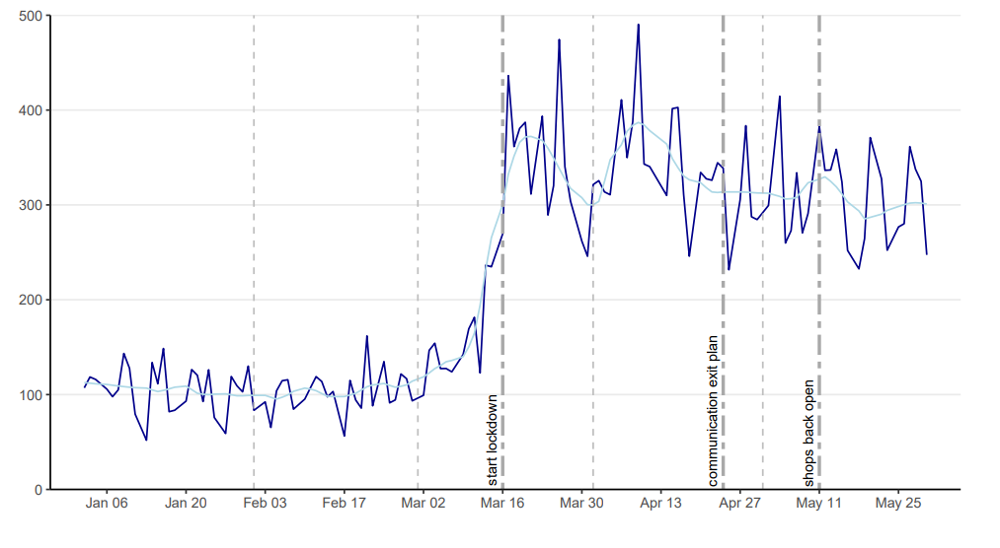

The Economic Policy Uncertainty (EPU) measures the economic risk when the government policy's future path is uncertain. This index can detect events and trends which correlate, for instance, with economic health and stock market downturns. This post showcase the Economic Policy Uncertainty for Belgium, which is divided into two parts: The Flander EPU and the Walloon EPU. 

The EPU index is derived daily from significant newspapers in french and dutch published in Belgium beginning January 2001 and **kept up to date daily on our home page**. In particular, we report a 30-day moving average of the daily index. The general idea behind the EPU index's construction is to detect news articles that contain triplets of words: One related to the Economy, one related to Policy, and one related to Uncertainty. These keywords are defined using a combination of expert opinion and Natural Language Processing methods.

Here is the monthly index for Belgium zoomed-in from January 2020 to May 2020, which includes the start of the COVID-19 pandemic to showcase the power of the Economic Policy Uncertainty Index.

The dynamics are interesting. January and February are calm months with a level around 100, which indicates the same degree of uncertainty as on average up to 2011. After that, the uncertainty unequivocally drives up, becomes more volatile transitioning from March to April, and decreasing in the last three weeks of April. Most of the uncertainty increased before the lockdown in Belgium was officially imposed. The uncertainty remains high in May, but at a fairly constant, and lower, daily level.

_Check out the paper on this index!_

- Algaba, A., Borms, S., Boudt, K., Borms & S., Van Pelt, J. (2020). **The Economic Policy Uncertainty Index for Flanders, Wallonia and Belgium**.  [Link](https://papers.ssrn.com/sol3/papers.cfm?abstract_id=3580000)

Download the data at 